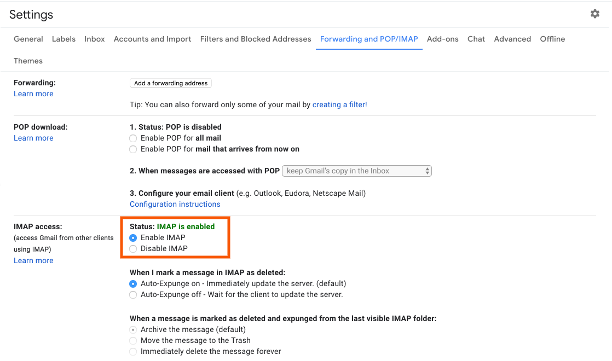
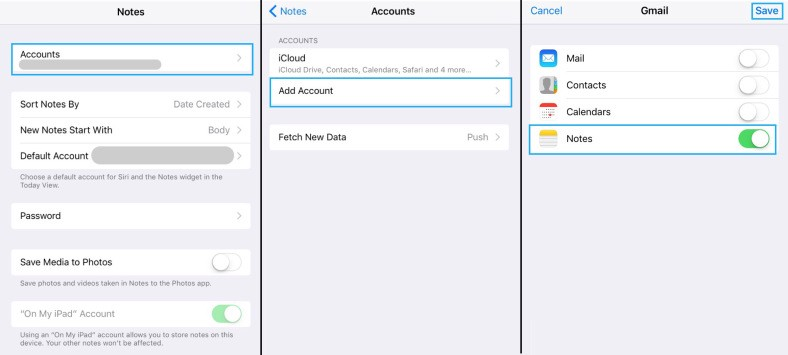
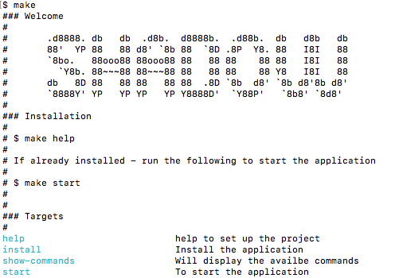

# shadow
Shadow - My Personal Assistant: Controled Over Siri
* No extra hardware required
* Runs on any computer with python installed
* You can use it from anywhere in the world

What it can do over Over Voice Command:
- Open Command Terminal 
- Open Slack
- Put Mac to Sleep :)

## Setup
How to Configure: 

**Gmail**

1) A Gmail account is required for SiriControl. For security reasons, I suggest creating a new Gmail account as you will have to enter your username and password in a python script. This won’t matter as you won’t be using this for personal everyday use — just for speaking commands.

2) Then, access for less secure apps needs to be turned on, which can be done here. This is because Google identifies the connection between the python script and mail servers as less secure.

3) As the script uses the IMAP protocol to fetch new Notes, IMAP needs to be enabled, under the Gmail settings.

**iOS Device**

1) Now, navigate to the following, in your Settings and add your newly created Gmail account:

    `Settings –> Notes –> Accounts –> Add Account`

2) Turn on Notes for that account.

3) Ensure that the default account for creating Notes with Siri is your new Gmail account.

That’s it! Now, just ask Siri to create a Note like this:

`“Note this is awesome”`

The new note should appear under the Notes label in your Gmail account. If not, please follow the above steps again.

**SHADOW Setup**

1) Firstly, download the scripts from [here](https://github.com/donofden/shadow).

2) Then, open up run `Make` will explain about availabe command / Instalation Guide and add your username and password of your new Gmail account to `config.ini` a sample file format is availabe `config-sample.ini`. 

3) Now, run the script and say to Siri:

“Note Start day”

This project is developed on top of [SiriControl](https://github.com/theraspberryguy/SiriControl-System) and added additional options for my need.